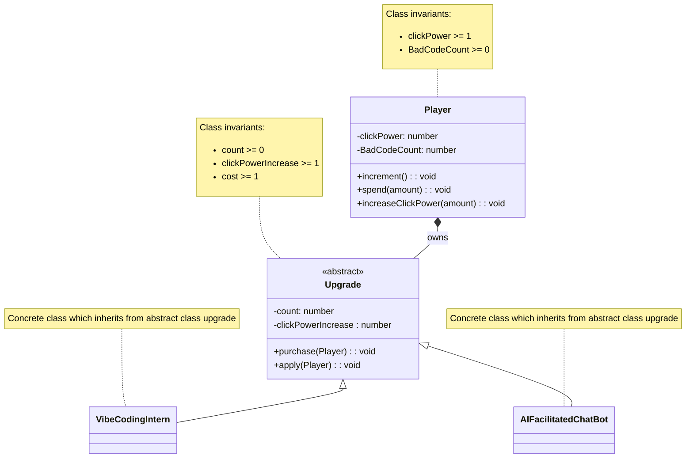

# Domain model

The domain model for the BadCode clicker game. You click to generate more and more bad code. You have a player class which keeps account of current stats and info and an abstract Upgrade class on which all upgrades are built. Each click is modified by the upgrades : the multipliers you own. The amount of upgrades you own also modifies the "clicking power".

