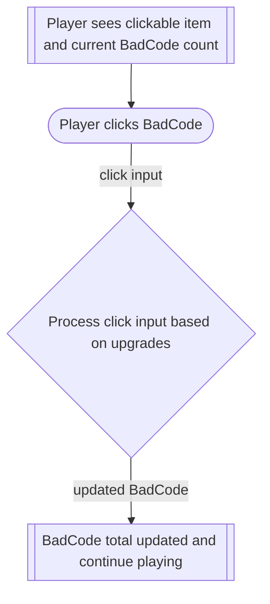
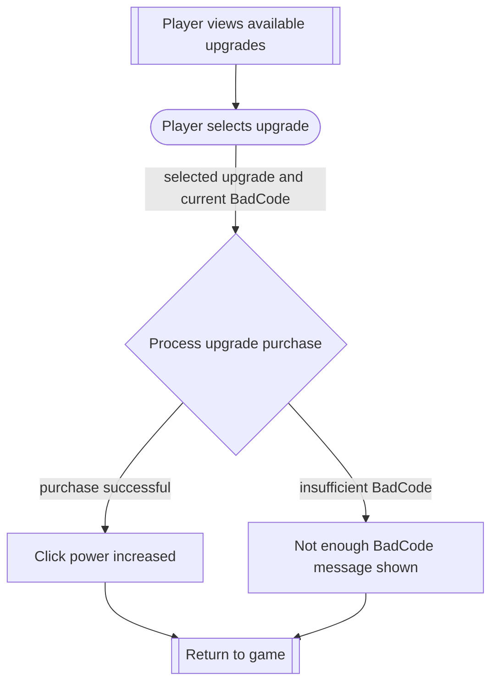
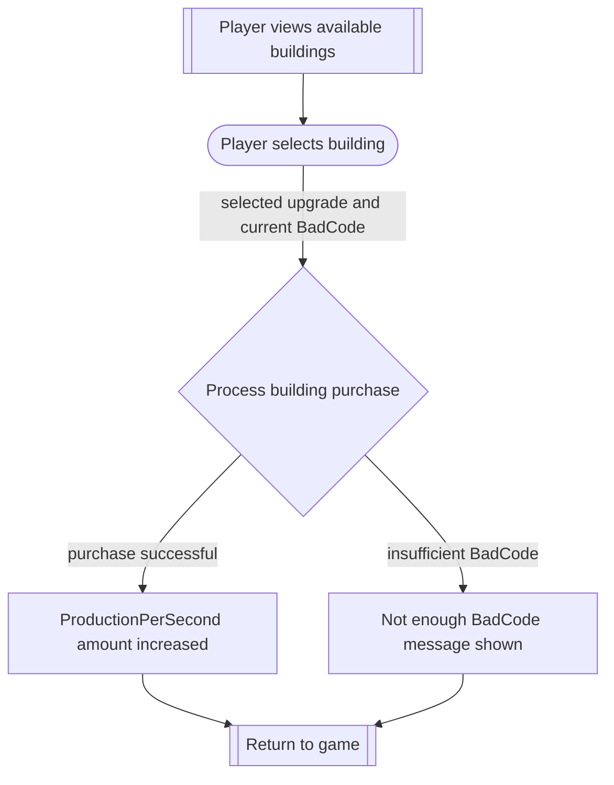
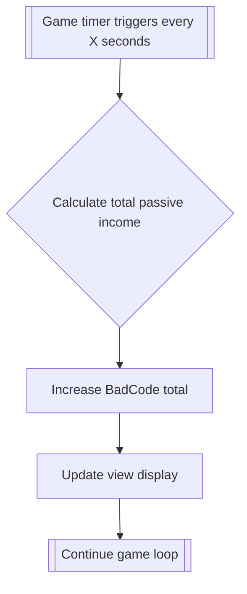

# Flows of interaction

This document describes how a person interacts with the Bad Code Clicker
application. Each flow represents a task that the user can perform while
using the game.

---

## Click on the item

This is the most basic task in the game. The player clicks on the main item and sees the total amount of Bad Code increase. Any previously
purchased upgrades affect the amount gained per click.

## Purchase Upgrades

The player may choose to purchase an upgrade to increase their clicking
power. If they do not have enough Bad Code, an error message is shown.

## Purchase Building

The player may choose to purchase an building which enables an auto clicker which gives you your current click power power 'x' times per 10 seconds.
It emulates you clicking the create bad code button.
If they do not have enough Bad Code, an error message is shown.

## Passive Production
How the passive production works in the current game flow
