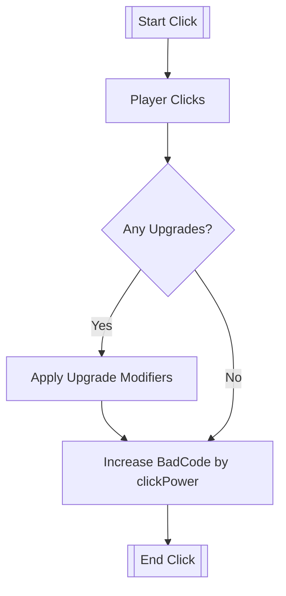
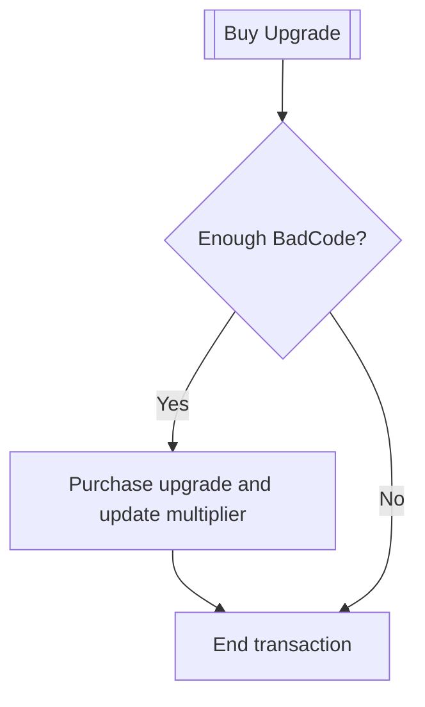

# Flows of interaction

## Click

This is the most basic task you can perform in the game. Increases total bad code by one or more depending on modifiers

```mermaid
flowchart
    StartClick[[Start Click]]
    Click[Player Clicks]
    CheckUpgrades{Any Upgrades?}
    ApplyMods[Apply Upgrade Modifiers]
    AddBadCode[Increase BadCode by clickPower]
    EndClick[[End Click]]

    StartClick --> Click --> CheckUpgrades
    CheckUpgrades -->|Yes| ApplyMods --> AddBadCode --> EndClick
    CheckUpgrades -->|No| AddBadCode
```

## Buy Upgrade

```mermaid
flowchart
    BuyUpgrade[[Buy Upgrade]]
    checkCost{Enough BadCode?}
    purchase[ Purchase upgrade and update multiplier]
    endTransaction[End transaction]

    BuyUpgrade --> checkCost --> |Yes| purchase --> endTransaction
    checkCost --> |No| endTransaction
```
