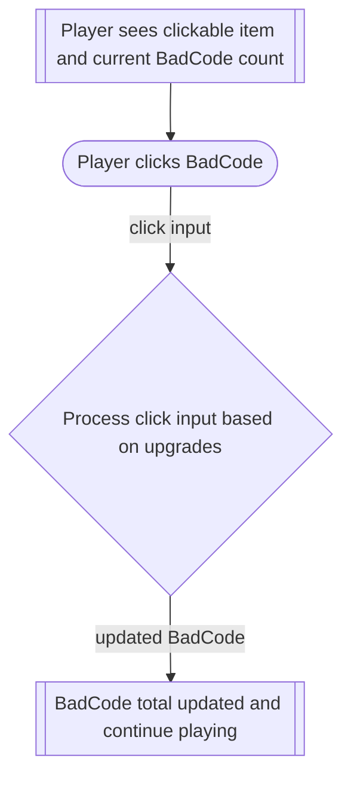
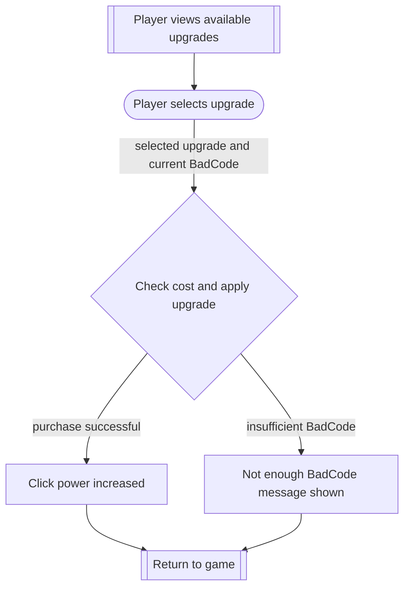
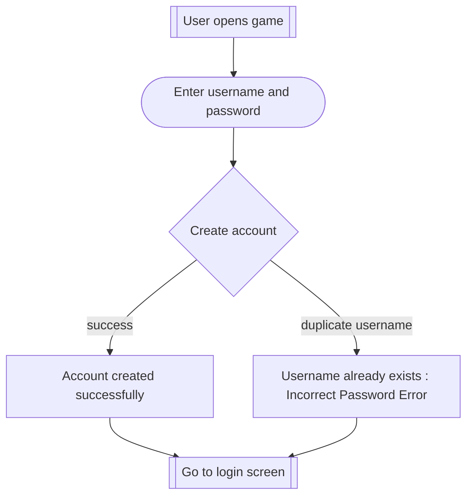
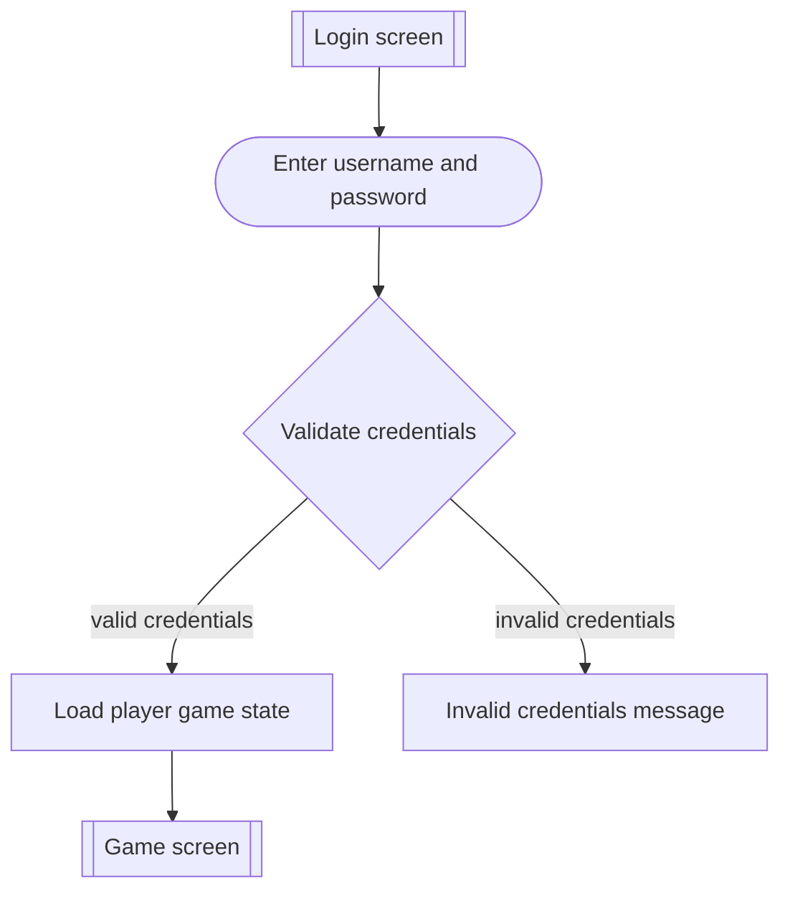
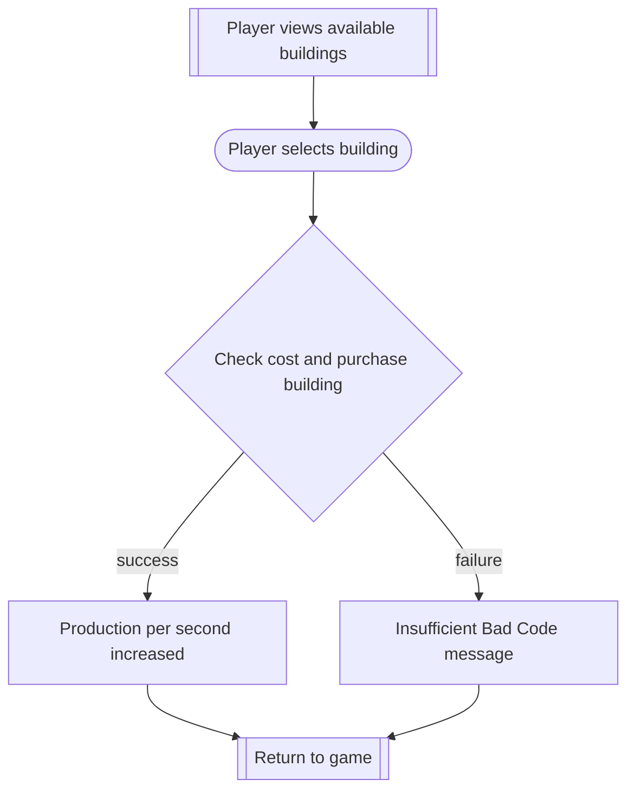
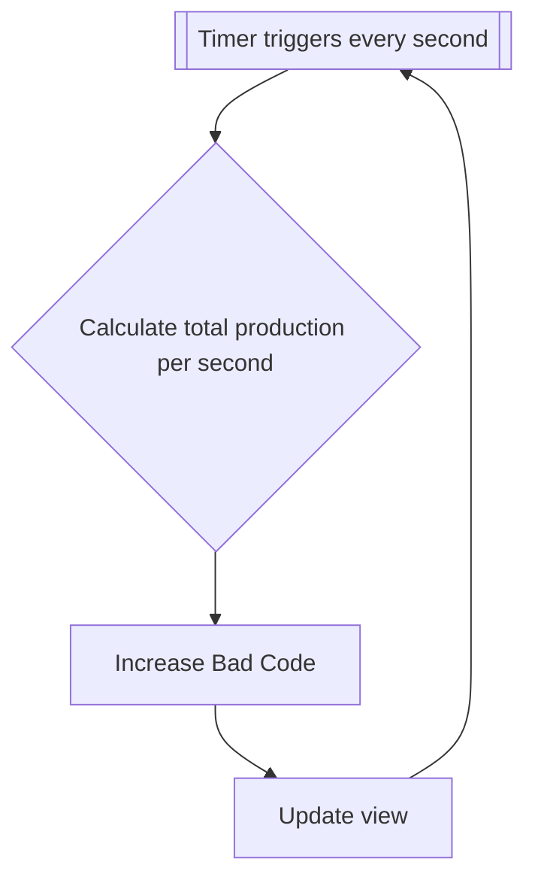
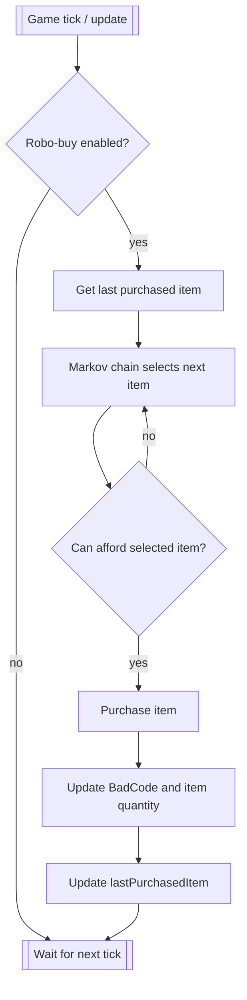

# Flows of interaction for phase 1

This document describes how a person interacts with the Bad Code Clicker
application. Each flow represents a task that the user can perform while
using the game.

---

## Click on the item

This is the most basic task in the game. The player clicks on the main item and sees the total amount of Bad Code increase. Any previously
purchased upgrades affect the amount gained per click.

```mermaid
flowchart TD
    view[[Player sees clickable item and current BadCode count]]
    clickItem([Player clicks BadCode])
    process{Process click input based on upgrades}
    endClick[[BadCode total updated and continue playing]]

    view --> clickItem
    clickItem -- click input --> process
    process -- updated BadCode --> endClick

```

## Purchase Upgrades

The player may choose to purchase an upgrade to increase their clicking
power. If they do not have enough Bad Code, an error message is shown.

```mermaid
flowchart TD
    view[[Player views available upgrades]]
    select([Player selects upgrade])
    process{Check cost and apply upgrade}
    success[Click power increased]
    fail[Not enough BadCode message shown]
    endUpgrade[[Return to game]]

    view --> select
    select -- selected upgrade and current BadCode --> process
    process -- purchase successful --> success
    process -- insufficient BadCode --> fail
    success --> endUpgrade
    fail --> endUpgrade

```

# Flows of Interaction for Phase 2

Focusing on buying buildings and account persistence

## Create Account

```mermaid
flowchart TD
    start[[User opens game]]
    create([Enter username and password])
    process{Create account}
    success[Account created successfully]
    fail[Username already exists : Incorrect Password Error]
    login[[Go to login screen]]

    start --> create
    create --> process
    process -- success --> success
    process -- duplicate username --> fail
    success --> login
    fail --> login
```

## Sign in

```mermaid
flowchart TD
    login[[Login screen]]
    input([Enter username and password])
    process{Validate credentials}
    success[Load player game state]
    fail[Invalid credentials message]
    home[[Game screen]]

    login --> input
    input --> process
    process -- valid credentials --> success
    success --> home
    process -- invalid credentials --> fail
```

## Purchase Building

The player may choose to purchase a building which enables an auto clicker and generates badCode automatically based on productionPerSecond.
It emulates you clicking the create bad code button.
If they do not have enough Bad Code, an error message is shown.

```mermaid
flowchart TD
    view[[Player views available buildings]]
    select([Player selects building])
    process{Check cost and purchase building}
    success[Production per second increased]
    fail[Insufficient Bad Code message]
    endFlow[[Return to game]]

    view --> select
    select --> process
    process -- success --> success
    process -- failure --> fail
    success --> endFlow
    fail --> endFlow
```

## Passive Production

How the passive production works in the current game flow

```mermaid
flowchart TD
    timer[[Timer triggers every second]]
    calculate{Calculate total production per second}
    update[Increase Bad Code]
    notify[Update view]

    timer --> calculate
    calculate --> update
    update --> notify
    notify --> timer
```

## Robo Buy

```mermaid
flowchart TD
    start[[Game tick / update]]
    checkToggle{Robo-buy enabled?}
    getLast[Get last purchased item]
    markov[Markov chain selects next item]
    canAfford{Can afford selected item?}
    buy[Purchase item]
    update[Update BadCode and item quantity]
    save[Update lastPurchasedItem]
    endTick[[Wait for next tick]]

    start --> checkToggle
    checkToggle -- no --> endTick
    checkToggle -- yes --> getLast

    getLast --> markov
    markov --> canAfford

    canAfford -- no --> markov
    canAfford -- yes --> buy

    buy --> update
    update --> save
    save --> endTick
```
