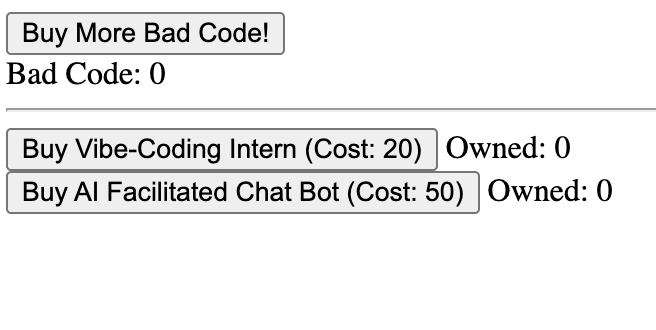
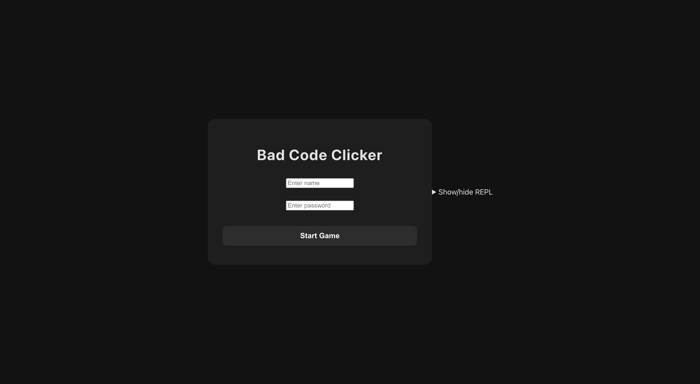
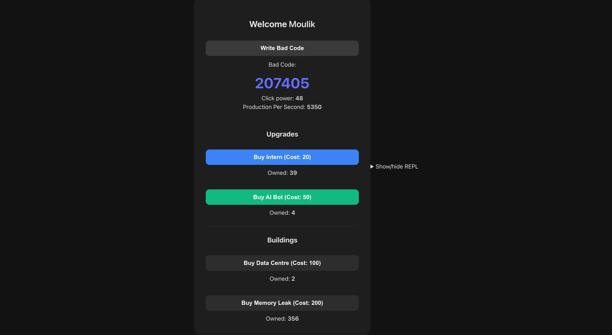
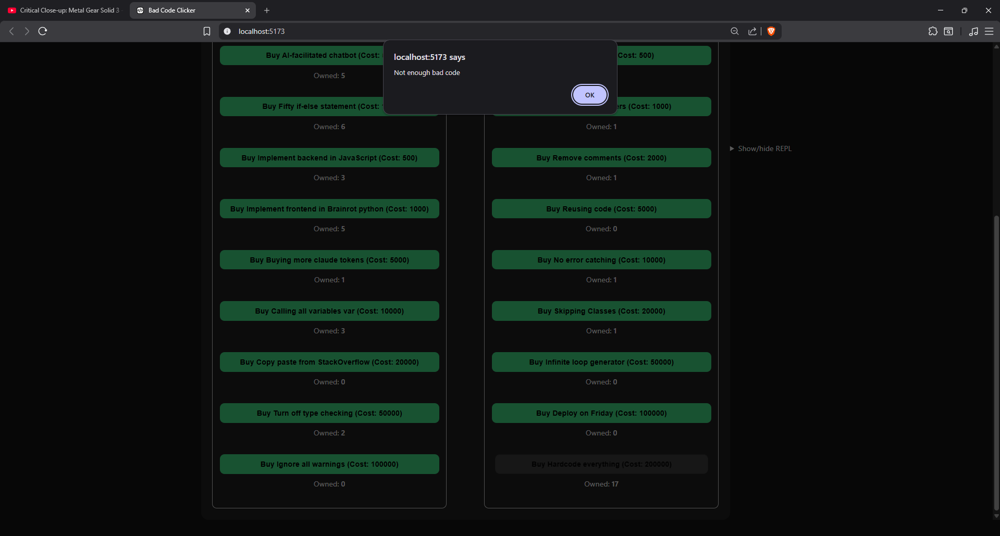
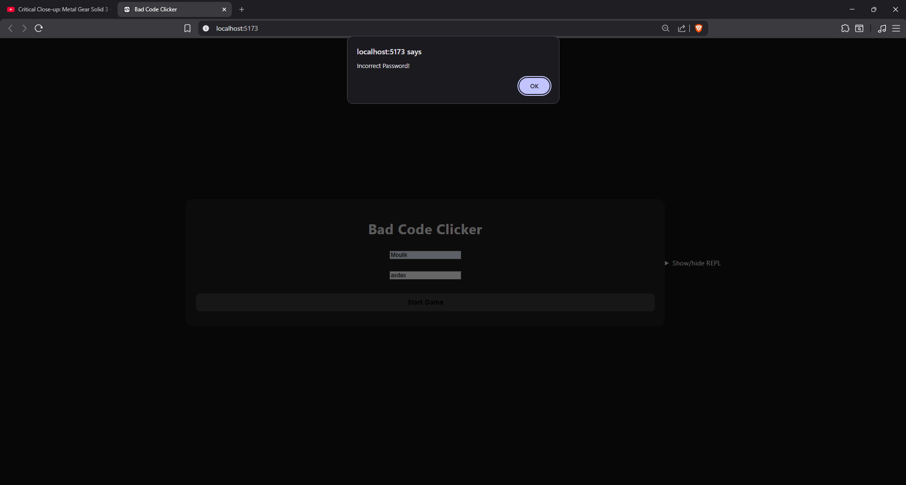

# Phase 1

Here's my entire UI for phase 1:

!

## Phase 1 visibility

My initial implementation of this UI was minimally visible because:

- :+1: The system does clearly show what state the user is in ( whether the game has started or not)

- :-1: Available actions (like upgrades) are visible but not clearly distinguished from unavailable ones.

## Phase 1 feedback

- :+1: Every time we processed a click , we would provide instant feedback in the form of increasing bad code.
  The user would know that the processing is over

- :+1: Every time user would try to do an illegal action or move, the system would provide
  them feedback of an error to prevent them from going forward with it

* :-1: Error messages are shown but they do not tell the user how to fix the issue.

## Phase 1 consistency

My initial implementation of this UI looked terrible, but had good consistency:

- :+1: Similar actions like purchasing upgrades and buildings follow the same flow (click → update stats).
- :-1: Some UI elements (like buttons vs labels) do not use icons or visual consistency.

* :+1: All buttons in the app had appropriate labels with verbs.

# Phase 2

Here are the major new parts of my interface for phase 2:

Here's the main UI as I submitted it for phase 2:

## Changes from phase 1

- The main change I made from phase 1 to phase 2 was implementing a brand new UI and a login system.

## Phase 2 Visibility

- :+1: The system clearly shows current stats such as total bad code and click power, so users always know their progress.
- :+1: The login and signup screens clearly indicate what the user is expected to do, with labeled input fields.
- :-1: The UI does not guide new users on what to do first after logging in, which reduces clarity for first-time use.
- :-1: Available and unavailable actions are not visually distinct. Buttons for upgrades and buildings appear clickable even when the user cannot afford them.
- :-1: There is no indication of the current game state beyond raw numbers (e.g., no highlight for recently purchased items).

## Phase 2 Feedback

- :+1: Clicking actions still updates the bad code count instantly, providing immediate system feedback.
- :-1: There is no clear confirmation when a purchase is made (no success message, animation, or highlight).
- :-1: The system does not show any loading or processing indicators during login or account creation.
- :-1: Error messages are shown when actions fail (e.g., insufficient resources), but:
  - They are not visually prominent
  - They do not guide the user on how to fix the issue
- :-1: There is no feedback indicating long-term progress (e.g., milestones or achievements), making the system feel less responsive over time.(Ex. the rebirth system in cookie clicker)

Here is an example of an error message shown when a user attempts to purchase an upgrade without enough bad code:

Here is an example of an invalid login attempt:

## Phase 2 Consistency

- :+1: Buttons and actions follow a consistent interaction pattern (click → update state).
- :+1: Input fields in the login system are consistently labeled and structured.
- :+1: Button labels use clear verbs (e.g., “Buy”, “Login”), maintaining consistency across the UI.
- :-1: Visual styling is inconsistent across different parts of the UI (e.g., game screen vs login screen feel like separate designs).
- :-1: Error messages are not styled consistently with the rest of the UI, making them feel disconnected from the system.

## How I might change my UI

- I would want to make unavailable actions translucent so that the user can know they are blocked out.
- I would add a notification for when upgrades are purchased and show a success/fail notification for them.
